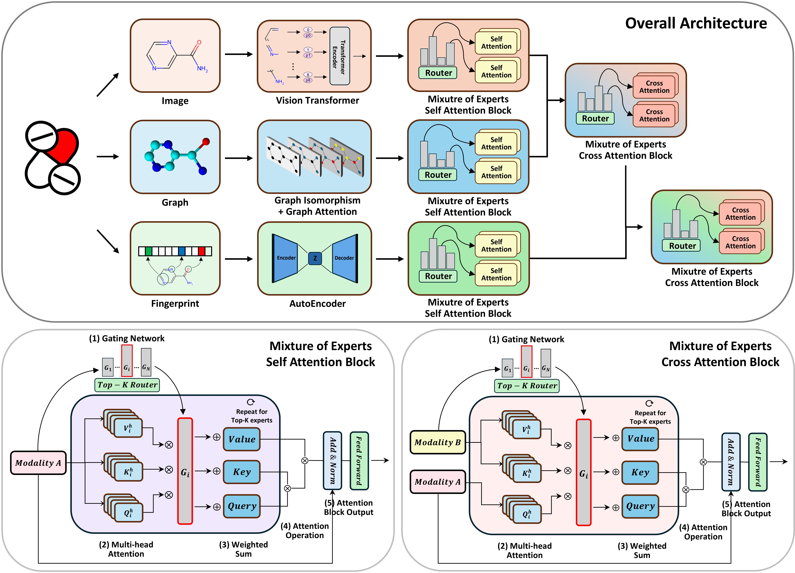

# MEMOL
Mixture of experts for multimodal learning through multi-head attention to predict drug toxicity

## Model Architecture

  

  <b>(a)</b> shows the overall framework. MEMOL processes three input modalities—image, graph, and FP—using a ViT, a GIN-GAT hybrid model, and an Autoencoder, respectively. The extracted embeddings pass through MoE self-attention blocks, followed by MoE cross-attention blocks to integrate modalities.  
  
  <b>(b)</b> and <b>(c)</b> represent an MoE self-attention block and an MoE cross-attention block, respectively. <b>(b)</b> processes a single input $X$ whereas <b>(c)</b> processes two inputs $X$ and $Y$.  
  
  In the MoE attention block, the following steps are sequentially carried out:  
  1. A gating network selects top $K$ experts based on computed scores, where the experts are generated from input $Y$.  
  2. Each selected expert independently performs multi-head attention, generating query, key, and value representations.  
  3. Expert outputs are aggregated via weighted summation.  
  4. Attention operation is performed using the accumulated $Q$, $K$, and $V$ representations.  
  5. A feed-forward network with residual connections and layer normalization enhances stability.

